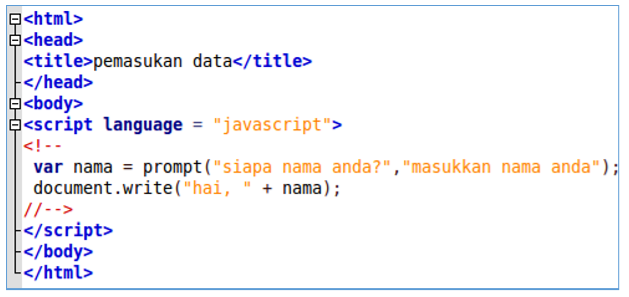
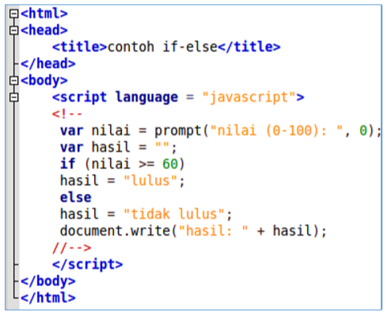
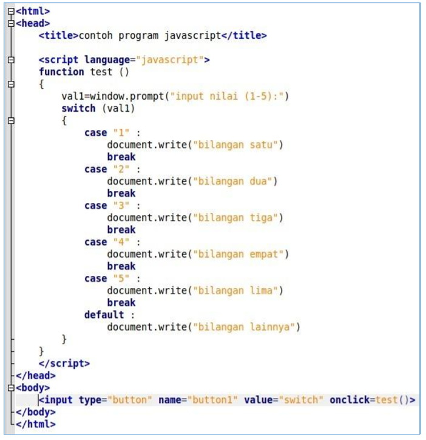
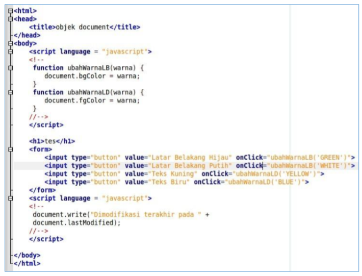

# Lab5_Javascript
## pertemuan ke-6
### Nama: Wayis Al Qorni TS
### Nim: 312010169
### Kelas: TI.20.A.1
### Mata Kuliah: Pemrograman Web

## 1.  Javascrip Dasar
### A. Pemakaian Alert sebagai property window.

<b>Hasilnya akan jadi seperti gambar di bawah ini:</b>

### B. Pemakaian method dalam objek 

<b>Hasilnya akan jadi seperti gambar di bawah ini:</b>

### C. Pemakaian Prompt 

<b>Hasilnya akan jadi seperti gambar di bawah ini:</b>

### D. Pembuatan fungsi dan cara pemanggilannya 

<b>Hasilnya akan jadi seperti gambar di bawah ini:</b>

## 2. Dasar Pemrograman Di Javascript 
### A. Operasi dasar aritmatika 

<b>Hasilnya akan jadi seperti gambar di bawah ini:</b>

### B. Seleksi kondisi (if..else) 

<b>Hasilnya akan jadi seperti gambar di bawah ini:</b>

### C. Penggunaan operator switch untuk seleksi kondisi 

<b>Hasilnya akan jadi seperti gambar di bawah ini:</b>

## 3. Pembuatan Form 
### A. Form Input 

<b>Hasilnya akan jadi seperti gambar di bawah ini:</b>

### B. Form Button

<b>Hasilnya akan jadi seperti gambar di bawah ini:</b>

## 4. HTML DOM 

Pilihan menggunakan checkBox dengan perhitungan otomatis 

<b>Hasilnya akan jadi seperti gambar di bawah ini:</b>

